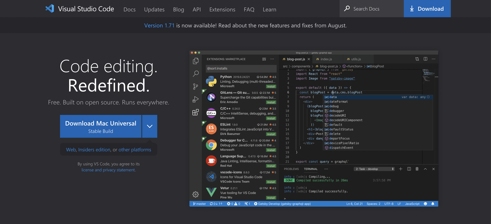
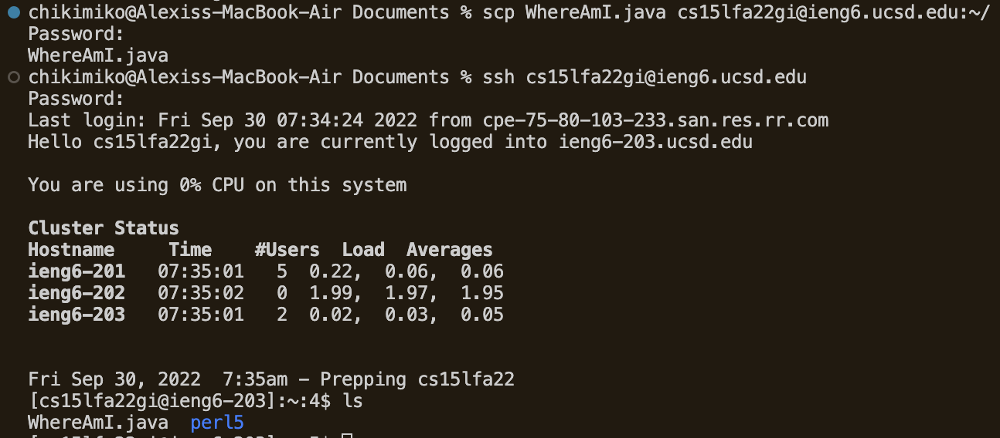
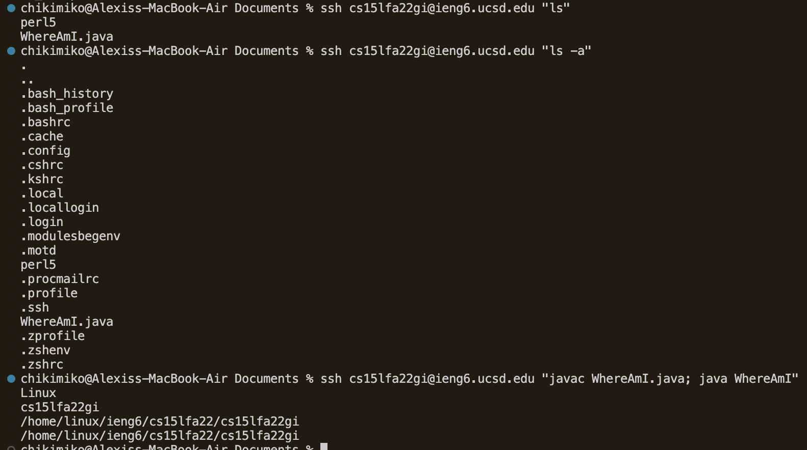

# installing vscode

go to [this website](https://code.visualstudio.com/) and download vscode<br>
make sure its for the right version!



# remotely connecting

in vscode, open up a terminal (cmd + `, or click Terminal then New Terminal on the menu)

next, enter this command but replace ```xx``` with the letters in your account
```
$ ssh cs15lfa22xx@ieng6.ucsd.edu
```

you should see something like this:


you are now using a terminal connected to a remote machine located in the cse basement!<br>
any commands you enter here will run on that computer

# trying some commands

run some of these commands:

```
cd ~        // change directory to root
```

```
cd          // change directory
```

```
ls          // lists the files in current directory
```
the ls command has optional flags, try a combination of -l, -a, and -t<br>
* -l gives the long format with more information
* -a includes hidden files
* -t sorts by last modified date in descending order

```
ls <directory> where <directory> is /home/linux/ieng6/cs15lfa22/cs15lfa22xx
```
try on other file paths too!

```
cp /home/linux/ieng6/cs15lfa22/public/hello.txt ~/
```

```
cat /home/linux/ieng6/cs15lfa22/public/hello.txt
```

## an example <br>


# moving files with scp

an important part about working with remote computers is being able to securely copy files from local to remote

the ```scp``` command is a way to copy a file on your computer to a remote computer

create a file on your local computer called ```WhereAmI.java``` and paste this:

```
class WhereAmI {
    public static void main(String[] args) {
        System.out.println(System.getProperty("os.name));
        System.out.println(System.getProperty("user.name"));
        System.out.println(System.getProperty("user.home"));
        System.out.println(System.getProperty("user.dir"));
    }
}
```

compile and run the WhereAmI program with
```
$ javac WhereAmI.java
$ java WhereAmI
```

now, in your current directory, type this command to copy the source code file over to your remote computer
```
$ scp WhereAmI.java cs15lfa22xx@ieng6.ucsd.edu:~/          // be sure to specify the file path after the ":"
                                                           // here, we put it into the root directory
```

## heres what it should look like



# setting up an ssh key

an ssh key is essentially an access key that computers utilize (through public and private key encryption) to establish validity in a remote connection

in other words, when you set up an ssh key, it allows you to become automatically verified as YOU so you won't have to enter in your password (but if you wanted to create an ssh key password you could too)

## on your local computer run

```
$ ssh-keygen
```
accept the default path (/Users/\<your username\>/.ssh/id_rsa) and enter in a password if you want, otherwise hit enter

now, we want to copy your public key over onto the remote computer
```
// on your local computer
$ ssh cs15lfa22xx@ieng6.ucsd.edu

// on remote server
$ mkdir .ssh
$ logout

// back on local
$ scp /Users/<your username>/.ssh/id_rsa.pub cs15lfa22xx@ieng6.ucsd.edu:~/.ssh/authorized_keys
```


now you can ssh and scp to the remote computer without entering your password everytime!

# optimizing remote running

commands can be run in line with the ssh command if you put it in quotes

## for example

```
$ ssh cs15lfa22xx@ieng6.ucsd.edu "ls"

// use semicolons to run multiple commands on the same line
$ cp WhereAmI.java OtherMain.java; javac OtherMain.java; java WhereAmI
```


