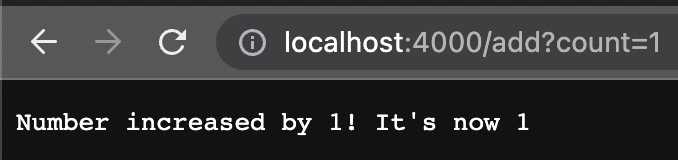
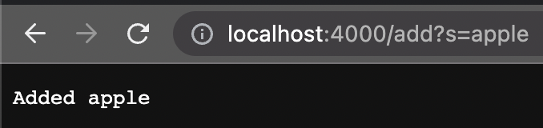
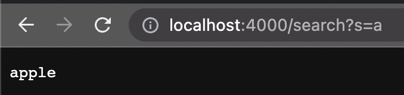
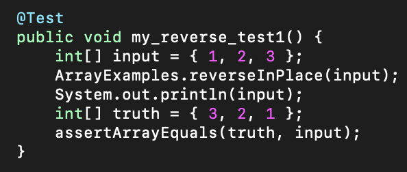
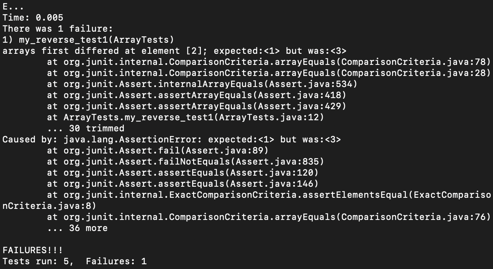
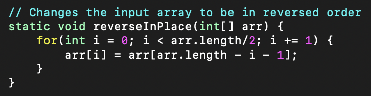
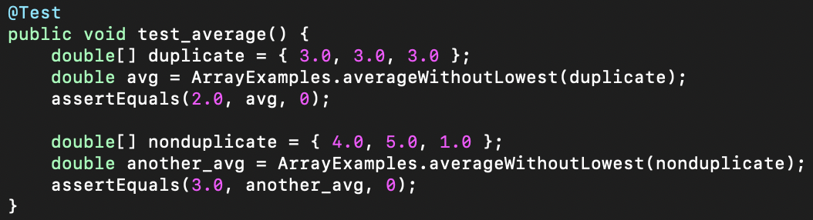
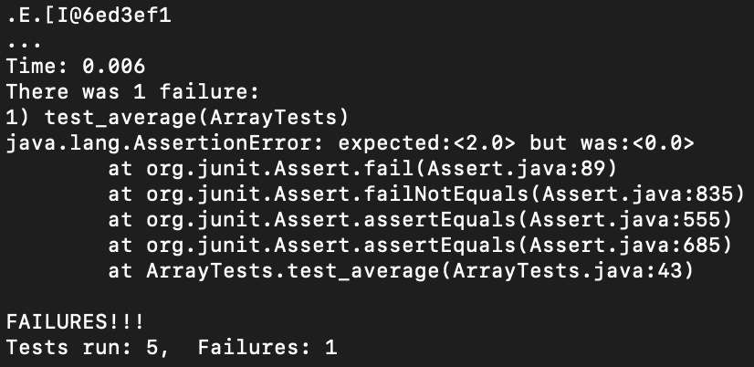
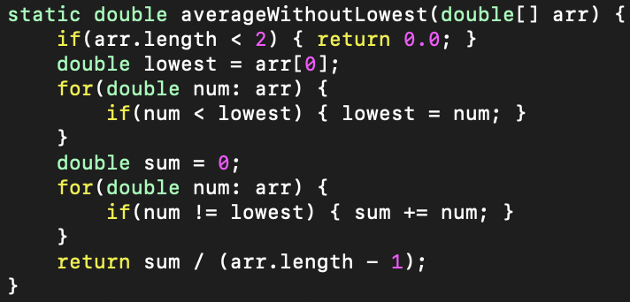

# code for my simple search engine

```
public String handleRequest(URI url) {
    if (url.getPath().equals("/")) {
        return String.format("Number: %d", num);
    } else if (url.getPath().equals("/increment")) {
        num += 1;
        return String.format("Number incremented!");
    } else if (url.getPath().contains("/add")) {
        System.out.println("the Path: " + url.getPath());
        String[] parameters = url.getQuery().split("=");
        if (parameters[0].equals("count")) {
            num += Integer.parseInt(parameters[1]);
            return String.format("Number increased by %s! It's now %d", parameters[1], num);
        } else if (parameters[0].equals("s")) {
            strarr.add(parameters[1]);
            return String.format("Added %s", parameters[1]);
        }
        return "404 Not Found!";
    } else if (url.getPath().contains("/search")) {
        System.out.println("the Path: " + url.getPath());
        String[] parameters = url.getQuery().split("=");
        if(parameters[0].equals("s")) {
            for(String str : strarr) {
                System.out.println(str);
                if(str.contains(parameters[1])) {
                    return String.format("%s", str);
                }
            }
        }
        System.out.println(parameters[1]);
        return "No Search Results Found!";
    }
    return "we have failed";
}
```
This code block holds the implementation for our live web server where we can watch a number get incremented by whatever count we want, as well as add words and search for them with the simple search engine.

## add to the number


Here, we give a path "add" and a query "count" with value 1 <br>
These arguments are passed through the handleRequest() method and increases the number by a count the user specifies.<br>
We can use any integer to add to the number by simply changing the value of count.

<br>

## add a result to the search engine


When we specify the "add" path and the query as "s" with value "apple", 
this will add a string to our search engine.<br>
These arguments are passed to the handleRequest() method and adds the specified value for the query to the search engine. Changing the value for s will add a different string to the search engine.

<br>

## search for a result


We use a the "search" path to search for a word in the search engine
When the handleRequest() method sees that we are pathing for a search, it will search for a matching result that we have added before. We specify the word we are looking for by changing the value of s.

# bugs!

## the failure-inducing input 



## the symptom



## the bug



## explanation

as we can observe from the symptom, the arrays compared at the test differed at element 2<br>
this reason why this happens is because when we set the value of the array at index i to the value at index arr.length - i - 1, we are losing the value at index i<br>
therefore, when we reach more than halfway through the list, we will not be able to access the original value of the array on the opposite side.<br>
To fix this bug, we need to keep a temporary variable for the ith element in the array so that we can swap it with the element on the opposite side of the array.


## the failure-inducing input 



## the symptom



## the bug



## explanation

as we can see from the symptom, the average was 0 when we expected 2.0<br>
this is the case because, in the code, we sum up all the numbers if they are not the lowest value<br>
this means that if there are duplicate values to the lowest value, we won't be contributing those values to the sum<br>
so when we have an array full of duplicates, we will see that the output will be 0 because we didn't sum up any numbers<br>
To fix this bug, we need to simply calculate the sum with the lowest number subtracted from it, rather than not sum numbers that match the same value.
