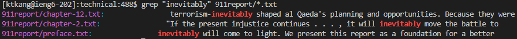
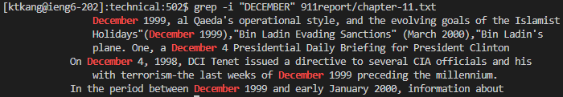
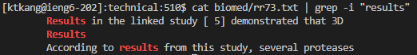
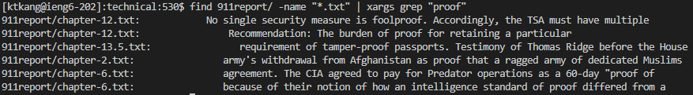
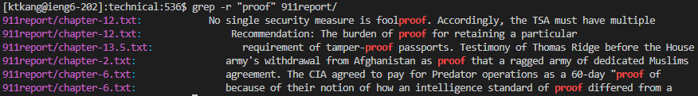
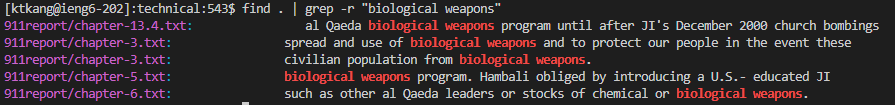
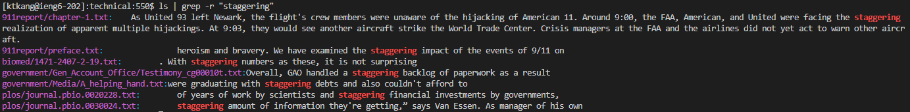
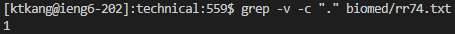
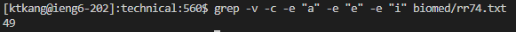
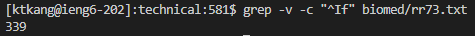

# grep

The grep command is used to search for any line that contains a word in a file. In this example, we search for the word "invetiably" in all text files in /technical/911report. 

## -i flag
1. 

Using the -i flag for grep, we can force grep to ignore word case. For example, in the image above, we searched technical/911report/chapter-11.txt for each line that match december, DECEMBER, December, and all other combinations.

2. 

Here, we "pipe" the output of the cat command into the input of the grep command. The output of rr73.txt is fed through as input to the grep command, which searches for all lines that contain "results", case insensitive.

3. 

Again, we are using pipe here. In this case, xargs is used so we are able to run grep with each result of the find command as an argument. 

## -r flag

1. 

The -r flag will search recursively and read all files under each directory for a matching string. In this image, we recursively search for the word proof in all files under 911report/

2. 

Here, we use the output of the find command and take it as input to the grep command. We recursively search everything listed from the find command and search for every line containing "biological weapons".

3. 

In this example, we run ls on the current directory, which lists all subdirectories. Then, we run grep on each directory recurisively searching for the word "staggering".

## -v flag (and more)

1. 

When you want to display the lines which does not matches the given string/pattern, use the option -v as shown above. This example will display all the lines that do not have a period in them. We also use the -c flag which counts how many lines match the given pattern.

2. 

In this example, we use the -c flag again as well as the -e flag. -e will indicate what pattern we want to match against. So, in this image, we are searching for the number of lines that do not contain "a", "e", or "i".

3. 

In this example, we search for the number of lines in biomed/rr73.txt that do not start with "If". The ^ regular expression pattern specifies the start of a line.