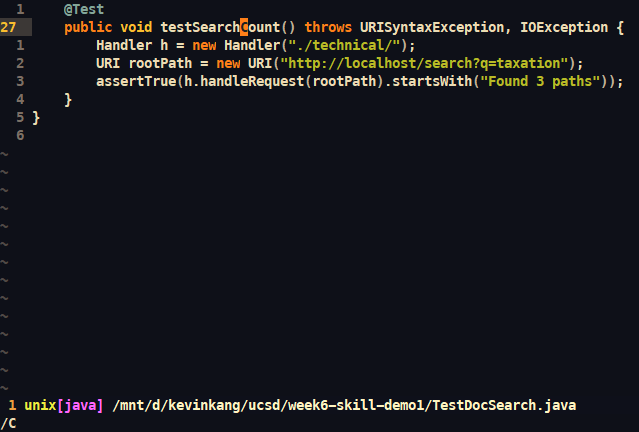
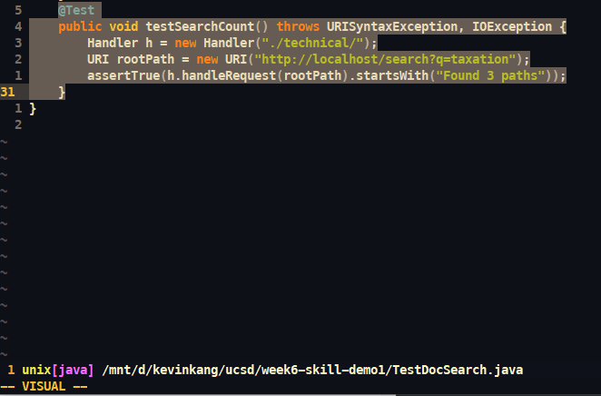
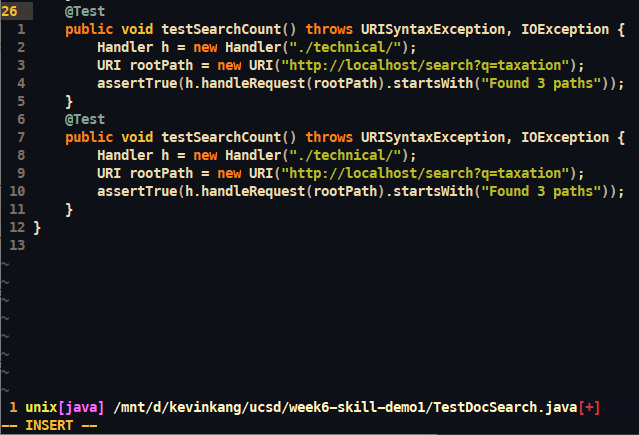
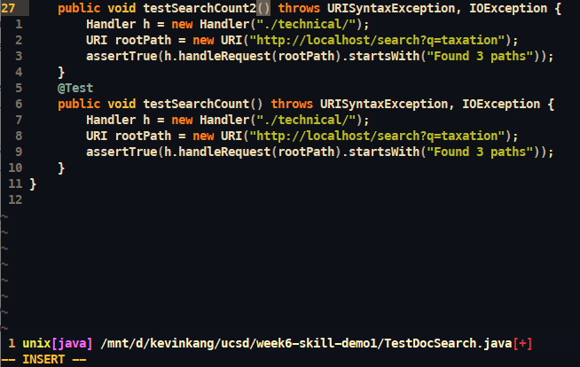
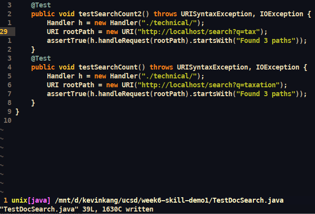

# shortest vim sequence
### **Challenge**: In TestDocSearch.java, copy the test called testSearchCount, rename the new test to testSearchCount2 and change the query string being tested to tax rather than taxation.<br><br>We did this in 29 keypresses:
```
/C<Enter>^kv5jykpi<Enter><Esc>6wi2<Esc>/xa<Enter>lde<Esc>:w
```

## **/C\<Enter>**

* We first search for a capital C to get to the function.

## **^kv5jy**

* ^ will jump to the beginning of the line, k to move up one line, v to enter visual mode, 5j to jump 5 lines down, and y to yank the entire function.

## **kpi\<Enter>**

* Hit k to jump up one line, p to paste a copy of the function, i to enter insert mode, then make a new line to format it properly.

## **\<Esc>6wi2**
 
 * \<Esc> to enter normal mode, 6w to jump 6 words forward, i to enter insert mode, edit a 2 at the end of the function name.

## **\<Esc>/xa\<Enter>lde\<Esc>:w**

* \<Esc> to enter normal mode, /xa <Enter> to place cursor at "xa", l to move cursor one character to the right, de to delete up until the end of the next word, then enter normal mode and write to the file.

## part 2

It took me 34 seconds in Visual Studio Code and 42 seconds in the ssh session. The tests ran long in the ssh session.

### **Which of these two styles would you prefer using if you had to work on a program that you were running remotely, and why?**
* I would prefer using vim to edit a file directly on the remote machine because it makes sense to work in the remote environment for a program running remotely. I also prefer using vim as my editor, and it is easier for me to focus.

### **What about the project or task might factor into your decision one way or another? (If nothing would affect your decision, say so and why!)**
* If I am working on a project locally, it may make more sense to use VSCode to work. If I am working on a project remotely, it may make more sense to remotely connect to the machine and use an editor in the terminal. Maybe if I worked at Microsoft, I would use VScode lol.
