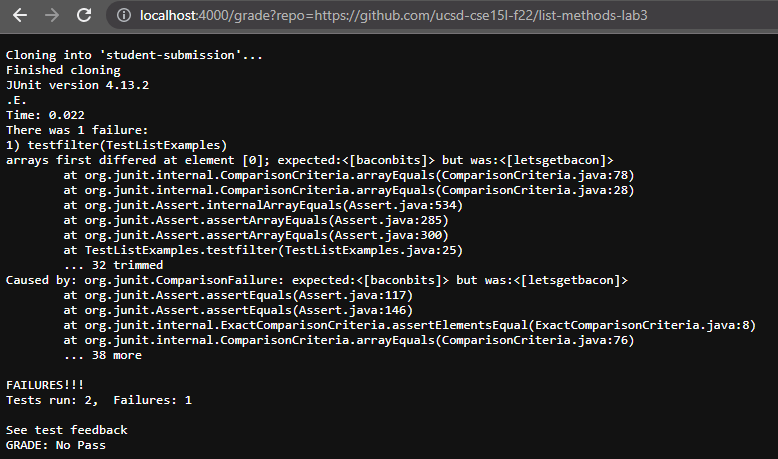
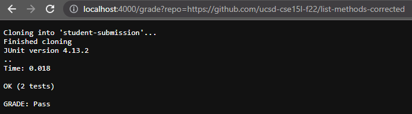
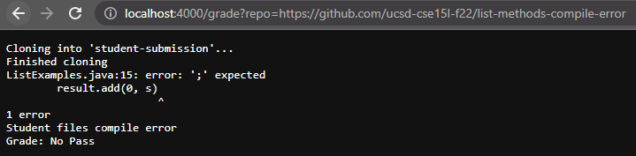

# code for grade.sh

```
CPATH=".:lib/hamcrest-core-1.3.jar:lib/junit-4.13.2.jar"

rm -rf student-submission
git clone $1 student-submission
echo 'Finished cloning'

cp student-submission/ListExamples.java ./

if [[ ! $? -eq 0 ]]
then
	echo "Student Submission does not contain required file"
	echo "GRADE: No Pass"
	exit 1
fi


javac -cp $CPATH *.java
if [[ ! $? -eq 0 ]]
then
	echo "Student files compile error"
	echo "Grade: No Pass"
	exit 2
fi

java -cp $CPATH org.junit.runner.JUnitCore TestListExamples

if [[ ! $? -eq 0 ]]
then
	echo "See test feedback"
	echo "GRADE: No Pass"
	exit 3
else
	echo "GRADE: Pass"
fi
```

## repo 1: https://github.com/ucsd-cse15l-f22/list-methods-lab3


## repo 2: https://github.com/ucsd-cse15l-f22/list-methods-corrected


## repo 3: https://github.com/ucsd-cse15l-f22/list-methods-compile-error



# analyzing repo 3
```
1  rm -rf student-submission
2  git clone $1 student-submission
3  echo 'Finished cloning'
```
Line 1 will remove the existing directory,
Line 2 will clone the repo in the student-submission directory,
Line 3 will push "Finished cloning" to stdout.<br>
For this repo, each of these commands will have a zero exit code.

```
1  cp student-submission/ListExamples.java ./
2  if [[ ! $? -eq 0 ]]
3  then
4  	  echo "Student Submission does not contain required file"
5	  echo "GRADE: No Pass"
6	  exit 1
7  fi
```
Line 1 will copy the ListExamples.java file to the current working directory,
Line 2 will check if the cp command's exit code was nonzero. 
It will also output the error to stderr if it exists. 
If it is, the student does not have the correct file and the grading script exits 
with a no pass score and outputs this to stdout.<br>
In this case, the student submission has the correct file so the cp command had a 0 exit code and the if statement did not run.

```
1  javac -cp $CPATH *.java
2  if [[ ! $? -eq 0 ]]
3  then
4	  echo "Student files compile error"
5	  echo "Grade: No Pass"
6	  exit 2
7  fi
```
Line 1 will compile the java file and the if block will check if the compilation failed. If it does, it will output to stdout that the student files had a compilation error and give a grade of no pass. The compilation error will be output to stderr.
For this repo, the compilation failed so this if block runs because the javac command had a nonzero exit code.
